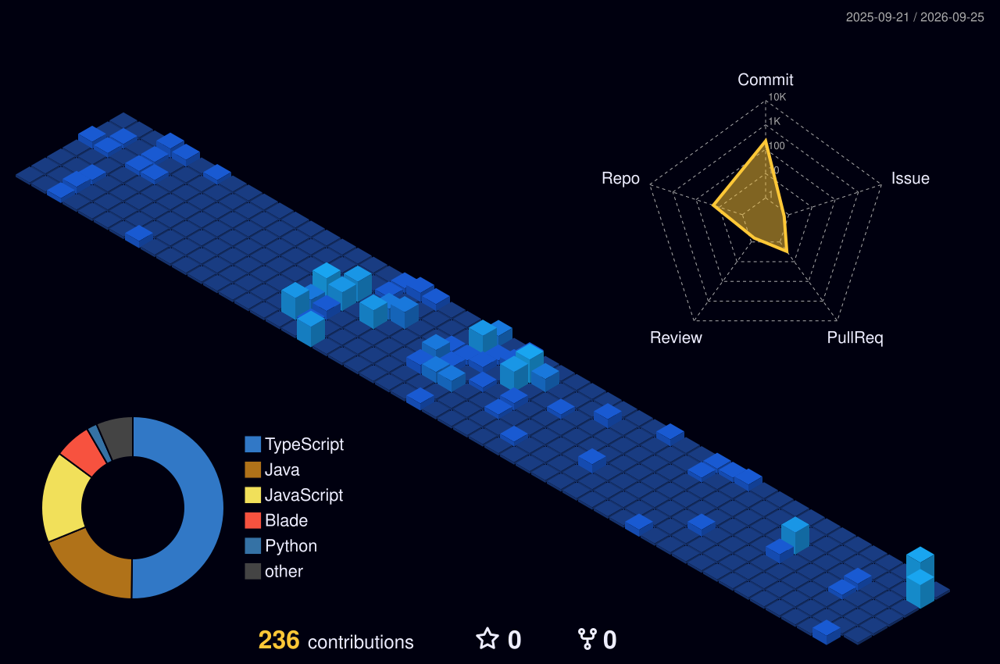

  

---

### Luiz Augusto

Desenvolvedor FullStack e bacharelando no 6° semestre de Engenharia de Software na PUCRS. Atualmente estagiário na VExpenses, atuando no desenvolvimento de sistemas ponta a ponta, microsserviços, arquiteturas escaláveis e aplicações web e mobile.

* **Atuação Atual:** Desenvolvedor FullStack Estagiário na VExpenses
* **Formação:** Engenharia de Software (PUCRS, Previsão: Dez/2027)
* **Práticas:** Clean Architecture, MVC, Design Patterns (Strategy, Factory), Testes Automatizados, CI/CD, Scrum e Kanban
* **Idiomas:** Português (Nativo), Inglês (B1)

---

### Tecnologias e Habilidades

  
  
  
  
  
  
  
    

  
  
  
  
  
  

    

  
  
  
  
  
  

    

  
  
  
  
  
  

---

### Projetos em Destaque

#### [Sistema de Pizzaria (Microsserviços)](https://github.com/Luiz1405/sistema-pizzaria-microsservico)
Arquitetura em microsserviços desenvolvida com Java 21 e Spring Cloud (Eureka, Load Balancer, Feign Client). Comunicação assíncrona via RabbitMQ, autenticação JWT centralizada no API Gateway, Clean Architecture, padrões Strategy/Factory e conteinerização total com Docker.

#### [LoveTravel](https://github.com/Luiz1405/love-travel)
Plataforma desenvolvida com banco de dados híbrido (PostgreSQL + MongoDB), camada de cache em Redis, autenticação Google OAuth 2.0, gerenciamento de arquivos via Supabase Storage, pipeline de CI/CD no GitHub Actions e deploy na nuvem Render.

---

### Atividade no GitHub

  

 

  

---

### Contato

